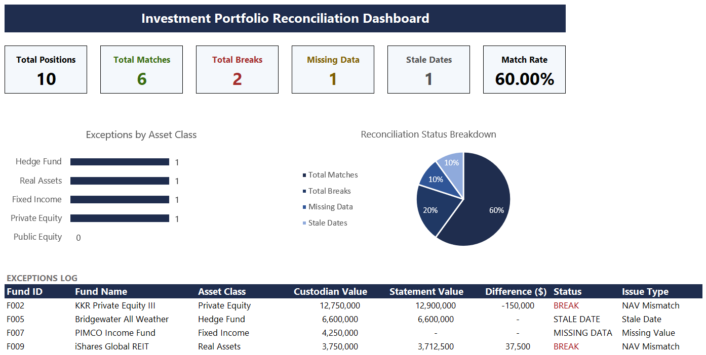

# Investment Portfolio Reconciliation Tracker

## Overview
An Excel-based reconciliation tool that simulates the process of validating 
investment data across two sources — a custodian report and a fund statement. 
Designed to replicate real analyst workflows in institutional investment data operations.

## Dashboard Preview

## Problem It Solves
Investment analysts must regularly reconcile data from multiple providers to ensure 
accuracy before client reporting. This tool automates that comparison, flags 
discrepancies, and surfaces exceptions for review — reducing manual effort and 
improving data quality.

## Features
- Power Query merge of two data sources (simulating custodian vs. fund statement)
- Automated break detection: NAV mismatches, missing values, and stale dates
- Tolerance-based status flagging (>0.5% variance = BREAK)
- Conditional formatting for instant visual review
- Dashboard with match rate, exception summary, and asset class breakdown

## Data Sources
Mock data representing 10 institutional investment funds across public equity, 
private equity, fixed income, hedge funds, and real assets.

## Tools Used
- Microsoft Excel
- Power Query (data ingestion, merging, transformation)

## How to Use
1. Open `investment_reconciliation_tracker.xlsx`
2. If source data changes, update the CSV files and click **Data → Refresh All**
3. Review the Reconciliation sheet for flagged exceptions
4. Use the Dashboard for a high-level summary

## Context
Built as a portfolio project to demonstrate data reconciliation, quality control, 
and workflow automation skills relevant to investment data analytics roles.

## Contact

**Gaspar Juico**  
Open to Data Analyst opportunities involving SQL, Power BI, and business intelligence.

- LinkedIn: [Gaspar Juico](https://www.linkedin.com/in/gasparjuico/)
- GitHub: [gasparjuico](https://github.com/gasparjuico)